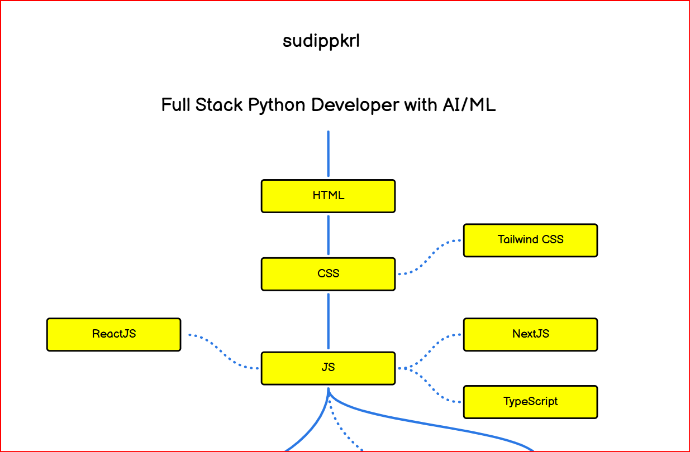
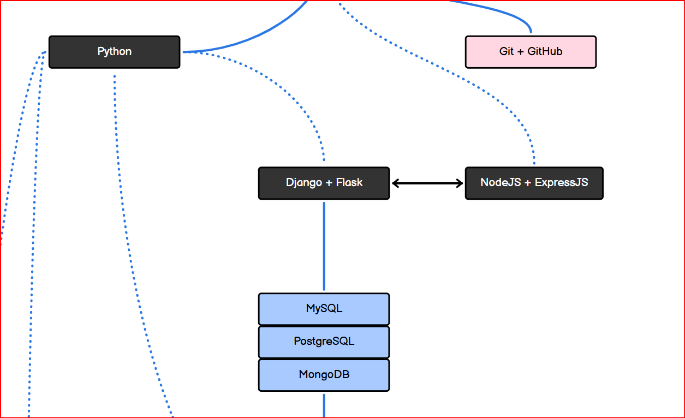
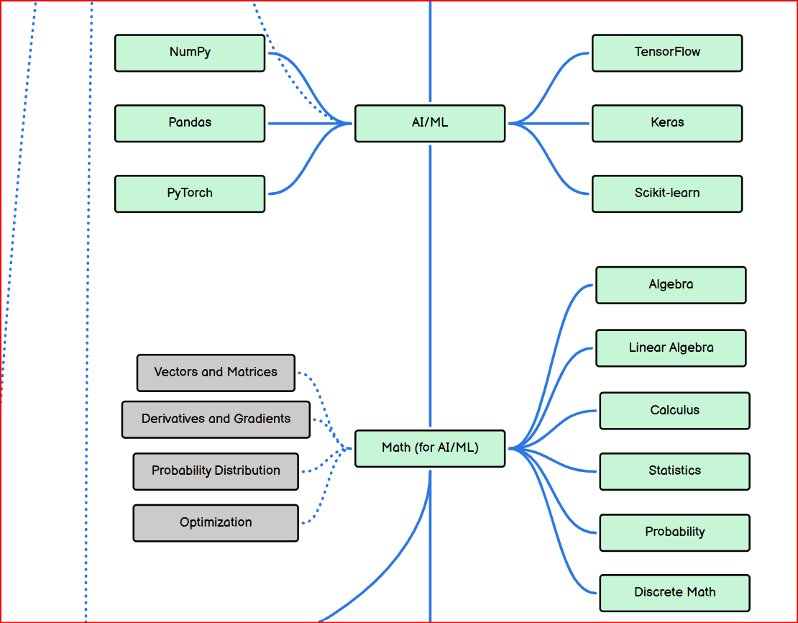
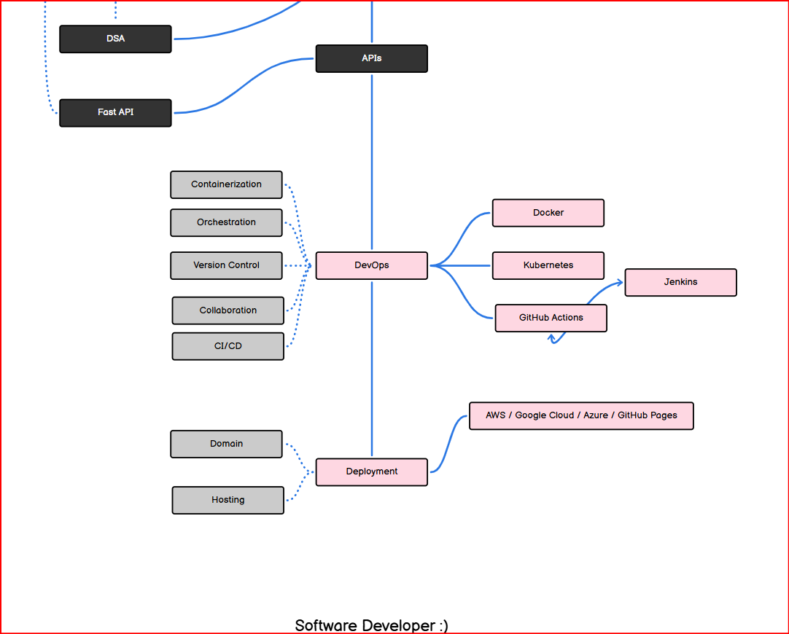
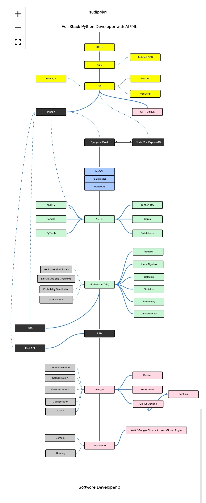

# Full Stack Python Developer Roadmap (with AI/ML + DevOps)
# Author:- Sudip Pokhrel
# Date:- April-28,2026

A complete, structured roadmap to become a **Full Stack Python Developer** with strong foundations in **AI/ML, DSA, and DevOps**.

🔗 **Live**: https://sudip-pkrl.github.io/roadmap/
🔗 **Original**: https://roadmap.sh/r/full-stack-python-developer-with-aiml

---

## 📷 Roadmap Preview

---

## 📌 Overview

This roadmap is designed to take you from **beginner → industry-ready developer** by combining:

* 🌐 Frontend Development
* ⚙️ Backend Development
* 🧠 AI & Machine Learning
* 🧩 Data Structures & Algorithms (DSA)
* 🗄️ Databases
* ⚙️ DevOps & Deployment
* ☁️ Cloud Platforms

---

## 🧩 Tech Stack Breakdown

### 🌐 Frontend Development

* HTML
* CSS (Tailwind CSS)
* JavaScript
* React.js
* Next.js
* TypeScript

---

### ⚙️ Backend Development

* Python

  * Django
  * Flask
  * FastAPI (for high-performance APIs ⚡)
    
* Node.js

  * Express.js

---

### 🔗 APIs & Backend Skills

* REST API development
* Authentication (JWT, OAuth)
* API integration
* Microservices basics

---

### 🧩 Data Structures & Algorithms (DSA)

* Arrays, Strings, Linked Lists
* Stacks, Queues
* Trees & Graphs
* Recursion & Backtracking
* Sorting & Searching
* Problem-solving using Python

---

### 🗄️ Databases

* MySQL
* PostgreSQL
* MongoDB

---

### 🧠 AI / Machine Learning

* NumPy
* Pandas
* PyTorch
* TensorFlow
* Keras
* Scikit-learn

---

### 📊 Math for AI/ML

* Linear Algebra
* Calculus
* Probability
* Statistics
* Discrete Mathematics
* Optimization Techniques

---

## ⚙️ DevOps & System Design Basics

### 🐳 Containerization

* Docker

### ☸️ Orchestration

* Kubernetes

### 🔄 CI/CD (Continuous Integration & Deployment)

* GitHub Actions
* Jenkins

### 🔧 Core DevOps Concepts

* Version Control (Git & GitHub)
* Collaboration workflows
* CI/CD pipelines
* Infrastructure basics

---

## 🚀 Deployment & Hosting

### 🌍 Domain & Hosting

* Buying domains
* Hosting static & dynamic apps

### ☁️ Cloud Platforms

* AWS
* Google Cloud Platform (GCP)
* Microsoft Azure

### ⚡ Easy Deployment Options

* GitHub Pages (for static sites)
* Backend deployment (Render, Railway, etc.)

---

## 🎯 Why This Roadmap?

Most roadmaps focus on **only one area**.

This roadmap helps you:

* Build **end-to-end full stack applications**
* Integrate **AI/ML into real products**
* Understand **DevOps & deployment**
* Become **job-ready + production-ready**

---

## 🛠️ Built Using

* roadmap.sh 
* Hosted using GitHub Pages

---

## 🤝 Contributing

Contributions are welcome!
You can:

* Suggest improvements
* Add new tools or technologies
* Improve structure or clarity

Just open an issue or submit a PR 🚀

---

## ⭐ Support

If you found this useful:

* Star ⭐ this repository
* Share it with others
* Follow for more content

---

## 📬 Connect

Let’s learn, build, and grow together 🚀
